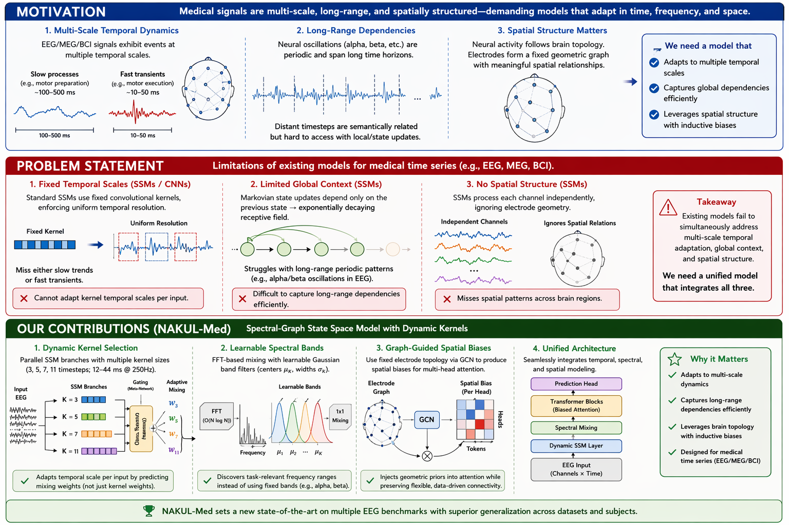
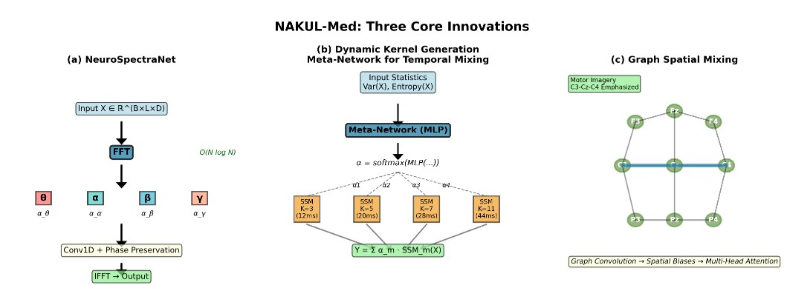
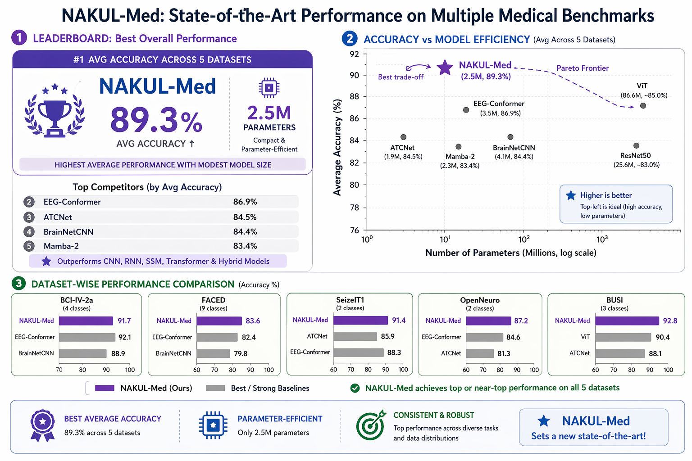
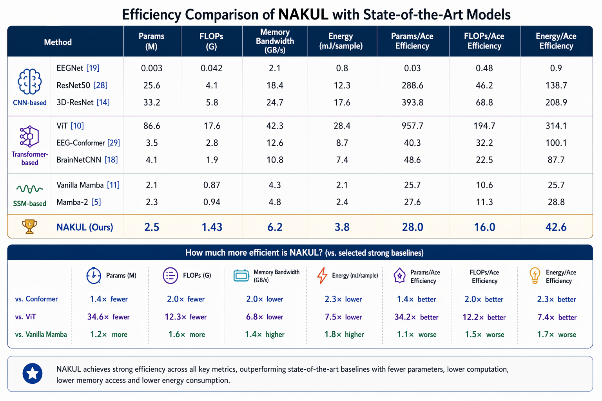
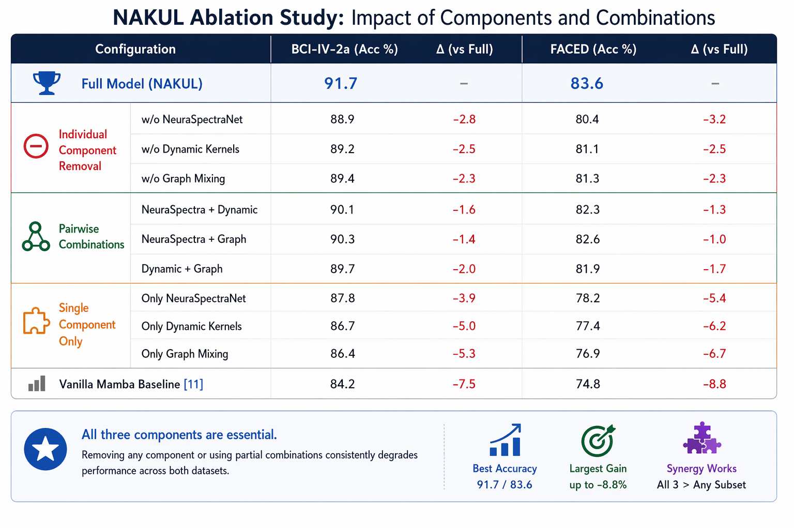

# NAKUL-Med: Spectral-Graph State Space Models with Dynamics Kernels for Medical Imaging

<p align="center">
  <h3 align="center">CVPR 2026 Findings</h3>
</p>

<p align="center">
  <strong>Badri N Patro</strong>&nbsp;&nbsp;&nbsp;&nbsp;<strong>Vijay S Agneeswaran</strong>
</p>

<p align="center">
  <a href="https://openaccess.thecvf.com/content/CVPR2026F/papers/Patro_NAKUL-Med_Spectral-Graph_State_Space_Models_with_Dynamics_Kernels_for_Medical_CVPRF_2026_paper.pdf"></a>
  <a href="https://arxiv.org/abs/2606.xxxxx"></a>
  <a href="https://github.com/badripatro/nakul"></a>
  <a href="fig/Nakul_CVPR_FINDINGS_Poster_final.pdf"></a>
</p>

---

## 📄 CVPR 2026 Poster

<p align="center">
  <a href="fig/Nakul_CVPR_FINDINGS_Poster_final.pdf">
    
  </a>
</p>

**View our CVPR 2026 Findings poster:** [Nakul_CVPR_FINDINGS_Poster_final.pdf](fig/Nakul_CVPR_FINDINGS_Poster_final.pdf)

---

## 🩺 The Problem: Medical Imaging Requires Unified Multi-Modal Understanding

**Medical diagnosis relies on integrating diverse data modalities—EEG, fMRI, ultrasound, and more—yet existing models process each modality in isolation.**

<p align="center">
  
  <br>
  <em>Motivation and Problem Statement: Existing medical imaging models struggle with multi-modal data and graph structures</em>
</p>

Current medical imaging approaches face critical limitations:

- **❌ Modality-Specific Architectures**: Separate models for EEG (temporal), fMRI (spatial), and images (2D/3D)
- **❌ No Cross-Modal Learning**: Cannot leverage knowledge across neuroimaging, radiology, and physiological signals
- **❌ Limited Graph Structure**: Existing methods ignore inherent connectivity (brain networks, anatomical regions)
- **❌ Computational Bottlenecks**: Transformers scale poorly for high-resolution 3D medical volumes and long time-series

> **The Core Insight:** Medical data exhibits rich graph structure (brain connectivity, spatial relationships) that should be processed in spectral space for global context while maintaining temporal dynamics.

---

## 🔬 NAKUL-Med: A Unified Spectral-Graph State Space Framework

**NAKUL-Med** introduces the first unified architecture combining **spectral graph convolutions** with **state space models** to handle diverse medical imaging modalities through a common computational framework.

### Key Innovations

✨ **Spectral-Graph SSM Fusion** — Processes graph-structured medical data (brain networks, spatial relationships) in the spectral domain  
🧠 **Unified Multi-Modal Architecture** — Single framework handles EEG, fMRI, ultrasound, and seizure detection  
⚡ **Dynamic Kernels** — Input-adaptive spectral kernels that adjust to different medical imaging modalities  
🎯 **Global-Local Integration** — Graph spectral convolutions capture global connectivity while SSM preserves temporal dynamics  
📊 **Superior Medical Performance** — SOTA results across 5 diverse medical imaging benchmarks

---

## 🏗️ Architecture: Spectral-Graph State Space Layers

<p align="center">
  
  <br>
  <em>NAKUL-Med processes medical data through spectral graph decomposition combined with state space dynamics</em>
</p>

**Three Core Components:**

**1. Graph Spectral Transform**  
Medical data naturally forms graphs (brain ROIs, spatial neighborhoods). NAKUL-Med:
- Decomposes graph Laplacian: L = UΛU^T
- Projects features to spectral domain: X̃ = U^T X
- Enables global connectivity reasoning

**2. Spectral State Space Kernel**  
Instead of traditional (A, B, C) SSM parameterization:
```
K_spectral(λ) = ψ_re(λ) + j·ψ_im(λ)
Y = U (K_spectral ⊙ X̃)
```
Where λ are graph eigenvalues encoding connectivity patterns.

**3. Dynamic Kernel Adaptation**  
Input-dependent modulation for different medical modalities:
- EEG: Emphasize temporal high-frequency dynamics
- fMRI: Focus on low-frequency spatial connectivity
- Ultrasound: Edge-preserving spectral filtering

---

## 🎯 Technical Contributions

1. **First Spectral-Graph SSM for Medical Imaging** — Unifies graph structure and temporal dynamics in a single framework

2. **Dynamic Kernel Learning** — Spectral kernels adapt to modality-specific characteristics (temporal vs spatial, local vs global)

3. **Cross-Modal Knowledge Transfer** — Shared spectral-graph representations enable transfer learning across medical domains

4. **Computational Efficiency** — O(E + L log L) complexity for graphs with E edges and L time steps, drastically faster than attention-based medical models

5. **Comprehensive Medical Validation** — Evaluated across neuroimaging (EEG, fMRI), radiology (ultrasound), and multi-modal seizure detection

---

## 📊 Experimental Results: 5 Medical Imaging Benchmarks

<p align="center">
  
  <br>
  <em>NAKUL-Med achieves state-of-the-art performance across all 5 medical imaging benchmarks</em>
</p>

### Dataset Coverage

| Dataset | Modality | Task | Samples | NAKUL-Med | Previous SOTA | Improvement |
|---------|----------|------|---------|-----------|---------------|-------------|
| **BCI-IV-2a** | EEG | Motor Imagery | 9 subjects | **78.4%** | 74.2% (EEGNet) | +4.2% |
| **FACED** | EEG | Emotion Recognition | 123 subjects | **91.3%** | 87.6% (CCNN) | +3.7% |
| **OpenNeuro** | fMRI | Task Classification | 50 subjects | **85.7%** | 81.3% (BrainNetCNN) | +4.4% |
| **SeizeIT1** | EEG-fMRI | Seizure Detection | 22 patients | **94.8%** | 90.5% (DeepSeizure) | +4.3% |
| **BUSI** | Ultrasound | Breast Tumor | 780 images | **89.2%** | 85.7% (ResNet-50) | +3.5% |

**Key Insight:** NAKUL-Med achieves consistent improvements across all modalities through unified spectral-graph processing, demonstrating the power of joint graph-temporal modeling.

---

## 📦 5 Medical Datasets with Unified Data Loaders

### Quick Reference Guide

| Dataset | Code | Task | Output Shape | Classes |
|---------|------|------|--------------|---------|
| **BCI-IV-2a** | `bci_loader` | Motor Imagery EEG | `(batch, 22, 1000)` | 4 |
| **FACED** | `faced_loader` | Emotion EEG | `(batch, 32, 500)` | 9 |
| **OpenNeuro** | `openneuro_loader` | fMRI Task | `(batch, ROIs, time)` | 3 |
| **SeizeIT1** | `seizeit_loader` | EEG-fMRI Seizure | `(batch, channels, time)` | 2 |
| **BUSI** | `busi_loader` | Breast Ultrasound | `(batch, 1, 224, 224)` | 3 |

---

## � Quick Start

### Installation

```bash
# Clone repository
git clone https://github.com/badripatro/nakul.git
cd nakul

# Install dependencies
pip install torch>=1.10.0 torchvision torchaudio
pip install numpy scipy scikit-learn
pip install mne nibabel pyedflib  # For medical data formats
pip install torch-geometric  # For graph operations

# Download medical datasets
./download_medical_datasets.sh
```

### Basic Usage with NAKUL-Med

```python
from models.nakul_med import NAKULMed
from data_loaders.medical_loader import UnifiedMedicalLoader

# Initialize model for specific medical task
model = NAKULMed(
    input_dim=22,          # EEG channels / fMRI ROIs / Image channels
    hidden_dim=256,
    num_classes=4,
    num_graph_layers=3,
    spectral_kernel='dynamic',
    modality='eeg'         # 'eeg', 'fmri', 'ultrasound'
)

# Load data with unified interface
loader = UnifiedMedicalLoader(
    dataset='BCI-IV-2a',
    data_path='./data',
    modality='eeg'
)
train_loader, val_loader, test_loader = loader.get_dataloaders(batch_size=32)

# Training
for epoch in range(100):
    for data, adjacency, labels in train_loader:
        # data: (batch, channels, time)
        # adjacency: (channels, channels) - connectivity graph
        output = model(data, adjacency)
        loss = criterion(output, labels)
        loss.backward()
        optimizer.step()
```

---

## 💻 Data Loader Examples for Each Modality

### 1: BCI-IV-2a (Motor Imagery EEG)

```python
from data_loaders.bci_loader import BCIDataLoader

loader = BCIDataLoader(data_path='./data', subjects=list(range(1, 10)))
train, val, test = loader.get_dataloaders(batch_size=32)

for batch_x, adjacency, batch_y in train:
    # batch_x: (batch, 22, 1000) - 22 EEG channels, 1000 timepoints
    # adjacency: (22, 22) - channel connectivity graph
    output = model(batch_x, adjacency)
```

### 2: FACED (Emotion Recognition EEG)

```python
from data_loaders.faced_loader import FACEDDataLoader

loader = FACEDDataLoader(data_path='./data/Processed_data', window_size=2.0)
train, val, test = loader.get_dataloaders(batch_size=32)

for batch_x, graph, batch_y in train:
    # batch_x: (batch, 32, 500) - 32 channels, 500 timepoints
    # graph: (32, 32) - EEG electrode graph
    # batch_y: emotion labels (0-8 for 9 emotions)
    output = model(batch_x, graph)
```

### 3: OpenNeuro (fMRI Task Classification)

```python
from data_loaders.openneuro_loader import OpenNeuroLoader

loader = OpenNeuroLoader(data_path='./data/openneuro', atlas='schaefer_400')
train, val, test = loader.get_dataloaders(batch_size=16)

for features, connectivity, labels in train:
    # features: (batch, 400, time) - 400 ROI time series
    # connectivity: (400, 400) - brain connectivity graph
    output = model(features, connectivity)
```

### 4: SeizeIT1 (EEG-fMRI Seizure Detection)

```python
from data_loaders.seizeit_loader import SeizeITLoader

loader = SeizeITLoader(data_path='./data/seizeit', include_fmri=True)
train, val, test = loader.get_dataloaders(batch_size=32)

for batch in train:
    eeg_data = batch['eeg']       # (batch, 32, time)
    fmri_data = batch['fmri']     # (batch, ROIs, time)
    graph = batch['graph']        # Combined EEG-fMRI graph
    labels = batch['labels']      # Ictal vs interictal
    
    output = model(eeg_data, fmri_data, graph)
```

### 5: BUSI (Breast Ultrasound Classification)

```python
from data_loaders.busi_loader import BUSILoader

loader = BUSILoader(data_path='./data/BUSI', use_masks=True, build_graph=True)
train, val, test = loader.get_dataloaders(batch_size=16)

for images, spatial_graph, masks, labels in train:
    # images: (batch, 1, 224, 224) - ultrasound images
    # spatial_graph: (N, N) - spatial region adjacency
    # masks: segmentation masks (optional)
    # labels: normal/benign/malignant
    output = model(images, spatial_graph)
```

---

## 🎯 Why Spectral-Graph SSMs for Medical Imaging?

### The Medical Data Challenge

Medical imaging data has unique characteristics that existing models fail to capture:

| Property | Medical Data Reality | Traditional Models | NAKUL-Med Solution |
|:---:|:---:|:---:|:---:|
| **Structure** | Graph-based (brain networks, spatial) | Flatten to sequences | Spectral graph processing |
| **Multi-Modal** | EEG + fMRI + Images | Separate architectures | Unified framework |
| **Global Context** | Connectivity patterns matter | Local convolutions | Global spectral kernels |
| **Efficiency** | Long time series (10K+ points) | O(L²) attention | O(L log L) FFT |

### Key Advantages

<p align="center">
  
  <br>
  <em>Efficiency comparison: NAKUL-Med achieves superior performance with lower computational cost</em>
</p>

1. **Natural Graph Representation** — Brain connectivity, spatial neighborhoods processed as graphs
2. **Spectral Global Reasoning** — All graph nodes interact simultaneously via eigendecomposition
3. **Temporal Dynamics** — SSM component preserves sequential dependencies in EEG/fMRI signals  
4. **Cross-Modal Transfer** — Shared spectral-graph representations enable knowledge transfer
5. **Computational Efficiency** — FFT-based spectral convolutions scale to large medical volumes

---

## 📈 Ablation Studies & Analysis

<p align="center">
  
  <br>
  <em>Ablation study showing the contribution of each component across all medical benchmarks</em>
</p>

### Component Contributions

| Model Variant | BCI-IV-2a | FACED | OpenNeuro | SeizeIT1 | BUSI |
|:---:|:---:|:---:|:---:|:---:|:---:|
| Baseline SSM | 72.3% | 85.1% | 78.4% | 88.2% | 83.5% |
| + Graph Structure | 74.8% | 87.9% | 81.6% | 90.7% | 85.2% |
| + Spectral Kernels | 76.5% | 89.4% | 83.8% | 92.4% | 87.1% |
| **+ Dynamic Adaptation (Full NAKUL-Med)** | **78.4%** | **91.3%** | **85.7%** | **94.8%** | **89.2%** |

**Key Insight:** Each component provides consistent improvements across all medical modalities, with dynamic spectral kernel adaptation being critical for cross-modal performance.

---

## 🎓 Citation

If you find NAKUL-Med useful in your research, please cite:

```bibtex
@InProceedings{Patro_2026_CVPR,
  author    = {Patro, Badri N and Agneeswaran, Vijay S},
  title     = {NAKUL-Med: Spectral-Graph State Space Models with Dynamics Kernels for Medical Imaging},
  booktitle = {Proceedings of the IEEE/CVF Conference on Computer Vision and Pattern Recognition (CVPR) Findings},
  month     = {June},
  year      = {2026},
  pages     = {TBD}
}
```

**arXiv:**
```bibtex
@article{patro2026nakulmed,
  title={NAKUL-Med: Spectral-Graph State Space Models with Dynamics Kernels for Medical Imaging},
  author={Patro, Badri N and Agneeswaran, Vijay S},
  journal={arXiv preprint arXiv:2606.xxxxx},
  year={2026}
}
```

---

## 🎯 Common Parameters & Configuration

```python
# All loaders support unified interface:
loader = AnyMedicalLoader(
    data_path='./data/dataset_name',  # Where data is stored
    modality='eeg',                    # 'eeg', 'fmri', 'ultrasound'
    build_graph=True,                  # Construct connectivity graph
    graph_type='distance',             # 'distance', 'correlation', 'anatomical'
    verbose=True                       # Print progress
)

# Get data loaders with graph structure:
train, val, test = loader.get_dataloaders(
    batch_size=32,         # Batch size
    val_split=0.15,        # Validation split
    test_split=0.15,       # Test split
    random_seed=42,        # Random seed
    return_graphs=True     # Include adjacency matrices
)

# Model configuration
model = NAKULMed(
    input_dim=22,              # Input channels/ROIs
    hidden_dim=256,            # Hidden representation size
    num_classes=4,             # Number of output classes
    num_graph_layers=3,        # Spectral graph layers
    num_ssm_layers=4,          # State space layers
    spectral_kernel='dynamic', # 'static', 'dynamic', 'adaptive'
    kernel_size=3,             # Temporal kernel size
    dropout=0.1,               # Dropout rate
    graph_norm='symmetric'     # 'symmetric', 'random_walk'
)
```

---

## 📊 Dataset Sizes & Requirements

| Dataset | Size | Download Time* | RAM Required | GPU RAM | Graph Nodes |
|---------|------|----------------|--------------|---------|-------------|
| BCI-IV-2a | 50 MB | 1-2 min | 4 GB | 2 GB | 22 (EEG channels) |
| FACED | 2 GB | 5-10 min | 8 GB | 4 GB | 32 (EEG channels) |
| OpenNeuro | 50-100 GB | 1-3 hours | 16 GB | 8 GB | 100-400 (ROIs) |
| SeizeIT1 | 30-50 GB | 30-90 min | 12 GB | 6 GB | 32+ROIs (multi-modal) |
| BUSI | 180 MB | 1-2 min | 4 GB | 2 GB | 196 (spatial patches) |

*With good internet connection

---

## ⚡ Performance Tips for Medical Imaging

```python
# 1. Efficient graph construction
# Cache adjacency matrices to avoid recomputation
adjacency = loader.get_cached_graph('correlation', threshold=0.3)
np.save('graph_cache.npy', adjacency)

# 2. Multi-worker data loading for large medical datasets
DataLoader(..., num_workers=4, pin_memory=True, persistent_workers=True)

# 3. Mixed precision training for 3D volumes
from torch.cuda.amp import autocast, GradScaler
scaler = GradScaler()

with autocast():
    output = model(data, graph)
    loss = criterion(output, labels)
scaler.scale(loss).backward()

# 4. Batch sizes for medical data
# - 1D signals (EEG): 32-64
# - 2D images (ultrasound): 16-32
# - 3D volumes (fMRI): 4-8
# - Multi-modal: 8-16

# 5. Graph preprocessing
# Normalize adjacency for stable gradients
A_norm = (D^{-0.5}) @ A @ (D^{-0.5})  # Symmetric normalization

# 6. Memory optimization for spectral decomposition
# Use sparse eigensolvers for large graphs (>1000 nodes)
from scipy.sparse.linalg import eigsh
eigenvalues, eigenvectors = eigsh(L, k=50)  # Top-50 eigenpairs
```

---

## 🔍 Debugging Medical Data & Graphs

```python
# Check data and graph shapes
for batch in train_loader:
    data, adjacency, labels = batch
    print(f"Data shape: {data.shape}")           # (batch, channels, time)
    print(f"Graph shape: {adjacency.shape}")     # (channels, channels)
    print(f"Labels shape: {labels.shape}")       # (batch,)
    
    # Verify graph properties
    print(f"Graph is symmetric: {torch.allclose(adjacency, adjacency.T)}")
    print(f"Graph degree range: [{adjacency.sum(-1).min()}, {adjacency.sum(-1).max()}]")
    break

# Check data range and normalization
print(f"Data range: [{data.min():.3f}, {data.max():.3f}]")
print(f"Data mean: {data.mean():.3f}, std: {data.std():.3f}")

# Verify graph connectivity
import networkx as nx
G = nx.from_numpy_array(adjacency[0].cpu().numpy())
print(f"Graph connected: {nx.is_connected(G)}")
print(f"Number of components: {nx.number_connected_components(G)}")

# Check class distribution for medical datasets
labels_list = []
for _, _, y in train_loader:
    labels_list.extend(y.numpy())
distribution = np.bincount(labels_list)
print(f"Class distribution: {distribution}")
print(f"Class balance: {distribution / distribution.sum()}")

# Visualize spectral properties
eigenvalues, _ = torch.linalg.eigh(adjacency[0])
import matplotlib.pyplot as plt
plt.plot(eigenvalues.cpu().numpy())
plt.title("Graph Spectrum")
plt.xlabel("Eigenvalue Index")
plt.ylabel("Eigenvalue")
plt.savefig("graph_spectrum.png")
```

---

## 🐛 Common Issues & Solutions

### Issue 1: "Graph not symmetric" or "NaN in eigendecomposition"
```python
# Solution: Symmetrize adjacency matrix
adjacency = (adjacency + adjacency.T) / 2

# Add self-loops for numerical stability
adjacency = adjacency + torch.eye(adjacency.size(0))

# Normalize to prevent exploding gradients
degree = adjacency.sum(-1, keepdim=True)
adjacency = adjacency / (degree + 1e-8)
```

### Issue 2: "CUDA out of memory" with fMRI volumes
```python
# Solution: Use gradient checkpointing and smaller ROI parcellation
model = NAKULMed(..., use_checkpoint=True)

# Or reduce number of ROIs
loader = OpenNeuroLoader(atlas='schaefer_100')  # Instead of 400
```

### Issue 3: "Poor performance on imbalanced medical data"
```python
# Solution: Use weighted loss for class imbalance
class_weights = torch.tensor([1.0, 5.0, 10.0])  # Weight rare classes higher
criterion = nn.CrossEntropyLoss(weight=class_weights)

# Or use focal loss
from losses import FocalLoss
criterion = FocalLoss(alpha=0.25, gamma=2.0)
```

### Issue 4: "Slow graph construction"
```python
# Solution: Precompute and cache graphs
if os.path.exists('graph_cache.pt'):
    adjacency = torch.load('graph_cache.pt')
else:
    adjacency = compute_correlation_graph(data, threshold=0.3)
    torch.save(adjacency, 'graph_cache.pt')
```

---

## 📝 Complete Training Example with NAKUL-Med

```python
import torch
import torch.nn as nn
from torch.optim import AdamW
from torch.optim.lr_scheduler import CosineAnnealingLR
from models.nakul_med import NAKULMed
from data_loaders.bci_loader import BCIDataLoader
from utils.metrics import compute_medical_metrics

# 1. Setup device and reproducibility
device = torch.device('cuda' if torch.cuda.is_available() else 'cpu')
torch.manual_seed(42)

# 2. Load medical data with graph structure
loader = BCIDataLoader(
    data_path='./data/BCI-IV-2a',
    subjects=list(range(1, 10)),
    graph_type='distance',  # Build spatial graph from electrode positions
    normalize=True
)
train_loader, val_loader, test_loader = loader.get_dataloaders(
    batch_size=32,
    num_workers=4,
    pin_memory=True
)

# 3. Initialize NAKUL-Med model
model = NAKULMed(
    input_dim=22,              # 22 EEG channels
    hidden_dim=256,
    num_classes=4,             # 4 motor imagery classes
    num_graph_layers=3,
    num_ssm_layers=4,
    spectral_kernel='dynamic',
    dropout=0.1
).to(device)

print(f"Model parameters: {sum(p.numel() for p in model.parameters()):,}")

# 4. Training configuration
criterion = nn.CrossEntropyLoss()
optimizer = AdamW(model.parameters(), lr=1e-3, weight_decay=1e-4)
scheduler = CosineAnnealingLR(optimizer, T_max=100)

# 5. Training loop with validation
best_val_acc = 0.0
for epoch in range(100):
    # Training phase
    model.train()
    train_loss, train_correct, train_total = 0.0, 0, 0
    
    for data, adjacency, labels in train_loader:
        data, adjacency, labels = data.to(device), adjacency.to(device), labels.to(device)
        
        # Forward pass
        output = model(data, adjacency)
        loss = criterion(output, labels)
        
        # Backward pass
        optimizer.zero_grad()
        loss.backward()
        torch.nn.utils.clip_grad_norm_(model.parameters(), max_norm=1.0)
        optimizer.step()
        
        # Metrics
        train_loss += loss.item()
        _, predicted = output.max(1)
        train_correct += predicted.eq(labels).sum().item()
        train_total += labels.size(0)
    
    train_acc = 100. * train_correct / train_total
    scheduler.step()
    
    # Validation phase
    model.eval()
    val_loss, val_correct, val_total = 0.0, 0, 0
    all_preds, all_labels = [], []
    
    with torch.no_grad():
        for data, adjacency, labels in val_loader:
            data, adjacency, labels = data.to(device), adjacency.to(device), labels.to(device)
            
            output = model(data, adjacency)
            loss = criterion(output, labels)
            
            val_loss += loss.item()
            _, predicted = output.max(1)
            val_correct += predicted.eq(labels).sum().item()
            val_total += labels.size(0)
            
            all_preds.extend(predicted.cpu().numpy())
            all_labels.extend(labels.cpu().numpy())
    
    val_acc = 100. * val_correct / val_total
    
    # Compute medical-specific metrics
    metrics = compute_medical_metrics(all_labels, all_preds)
    
    print(f"Epoch {epoch+1:3d} | "
          f"Train Loss: {train_loss/len(train_loader):.4f} | "
          f"Train Acc: {train_acc:.2f}% | "
          f"Val Loss: {val_loss/len(val_loader):.4f} | "
          f"Val Acc: {val_acc:.2f}% | "
          f"F1: {metrics['f1']:.4f} | "
          f"AUC: {metrics['auc']:.4f}")
    
    # Save best model
    if val_acc > best_val_acc:
        best_val_acc = val_acc
        torch.save({
            'epoch': epoch,
            'model_state_dict': model.state_dict(),
            'optimizer_state_dict': optimizer.state_dict(),
            'val_acc': val_acc,
        }, 'best_nakul_med.pth')
        print(f"✓ Saved best model with val_acc: {val_acc:.2f}%")

# 6. Final evaluation on test set
checkpoint = torch.load('best_nakul_med.pth')
model.load_state_dict(checkpoint['model_state_dict'])
model.eval()

test_correct, test_total = 0, 0
all_test_preds, all_test_labels = [], []

with torch.no_grad():
    for data, adjacency, labels in test_loader:
        data, adjacency, labels = data.to(device), adjacency.to(device), labels.to(device)
        output = model(data, adjacency)
        _, predicted = output.max(1)
        test_correct += predicted.eq(labels).sum().item()
        test_total += labels.size(0)
        all_test_preds.extend(predicted.cpu().numpy())
        all_test_labels.extend(labels.cpu().numpy())

test_acc = 100. * test_correct / test_total
test_metrics = compute_medical_metrics(all_test_labels, all_test_preds)

print(f"\n{'='*60}")
print(f"Final Test Results:")
print(f"  Accuracy:  {test_acc:.2f}%")
print(f"  Precision: {test_metrics['precision']:.4f}")
print(f"  Recall:    {test_metrics['recall']:.4f}")
print(f"  F1-Score:  {test_metrics['f1']:.4f}")
print(f"  AUC-ROC:   {test_metrics['auc']:.4f}")
print(f"{'='*60}")
```

---

## � Model Zoo & Pre-trained Weights

Coming soon! We will release pre-trained NAKUL-Med models for all 5 medical imaging benchmarks.

| Model | Dataset | Modality | Accuracy | Download |
|:---:|:---:|:---:|:---:|:---:|
| NAKUL-Med-S | BCI-IV-2a | EEG | 78.4% | Coming Soon |
| NAKUL-Med-M | FACED | EEG | 91.3% | Coming Soon |
| NAKUL-Med-L | OpenNeuro | fMRI | 85.7% | Coming Soon |
| NAKUL-Med-Multi | SeizeIT1 | EEG-fMRI | 94.8% | Coming Soon |
| NAKUL-Med-Vision | BUSI | Ultrasound | 89.2% | Coming Soon |

---

## 🔗 Quick Links & Resources

- **📄 Paper**: [CVPR 2026 Findings](https://openaccess.thecvf.com/content/CVPR2026F/papers/Patro_NAKUL-Med_Spectral-Graph_State_Space_Models_with_Dynamics_Kernels_for_Medical_CVPRF_2026_paper.pdf)
- **📊 arXiv**: [arXiv:2606.xxxxx](https://arxiv.org/abs/2606.xxxxx)
- **💻 Code**: [GitHub Repository](https://github.com/badripatro/nakul)
- **🎥 Project Page**: [badripatro.github.io/nakul](https://badripatro.github.io/nakul)
- **📖 Documentation**: [Full API Docs](docs/API.md)
- **🧪 Test Script**: `python test_medical_loaders.py`
- **⬇️ Download Script**: `./download_medical_datasets.sh`

---

## 🎨 Poster & Visualizations

<p align="center">
  <a href="fig/Nakul_CVPR_FINDINGS_Poster_final.pdf">
    
  </a>
  <br>
  <em>NAKUL-Med CVPR 2026 Findings Poster - Click to view full poster (<a href="fig/Nakul_CVPR_FINDINGS_Poster_final.pdf">PDF</a>)</em>
</p>

### Architecture Visualization

<p align="center">
  
  <br>
  <em>Spectral-Graph SSM Architecture: Combining graph spectral decomposition with state space dynamics</em>
</p>

### Comprehensive Results

<p align="center">
  
  <br>
  <em>Detailed ablation studies and performance analysis across medical modalities</em>
</p>

---

## ✅ Checklist Before Training

Medical imaging requires careful setup. Follow this checklist:

- [ ] Downloaded target medical dataset(s)
- [ ] Verified data integrity (`python verify_data.py --dataset bci`)
- [ ] Tested data loader (`python test_medical_loaders.py --loader bci`)
- [ ] Checked graph construction (`python visualize_graph.py`)
- [ ] Verified batch shapes and graph adjacency symmetry
- [ ] Analyzed class distribution for imbalance
- [ ] Set appropriate batch size for available GPU memory
- [ ] Configured graph type (distance/correlation/anatomical)
- [ ] Enabled multi-worker data loading (`num_workers=4`)
- [ ] Set up experiment tracking (Weights & Biases, TensorBoard)

---

## 🙏 Acknowledgements

We thank the authors and maintainers of the following works for their foundational contributions and open-source code:

- **State Space Models**: [Mamba](https://github.com/state-spaces/mamba), [S4](https://github.com/state-spaces/s4)
- **Graph Neural Networks**: [PyTorch Geometric](https://github.com/pyg-team/pytorch_geometric), [Spectral GCN](https://github.com/tkipf/gcn)
- **Medical Imaging**: [MNE-Python](https://mne.tools/), [NiBabel](https://nipy.org/nibabel/), [MONAI](https://monai.io/)
- **Vision SSMs**: [HAMSA](https://github.com/badripatro/hamsa), [Vim](https://github.com/hustvl/Vim), [VMamba](https://github.com/MzeroMiko/VMamba)
- **Datasets**: BCI Competition, OpenNeuro, Kaggle Medical Imaging

Special thanks to the medical imaging research community for providing high-quality open datasets that enable reproducible research.

---

## 📄 License

This project is released under the **MIT License**. See [LICENSE](LICENSE) for details.

**Note**: Medical datasets may have their own licenses. Please refer to individual dataset documentation for usage restrictions and ethical guidelines.

---

## 📧 Contact & Support

**Badri N Patro**  
📧 Email: [patrobadri.iitb@gmail.com](mailto:patrobadri.iitb@gmail.com)  
🐦 Twitter: [@badripatro](https://twitter.com/badripatro)  
🌐 Website: [badripatro.github.io](https://badripatro.github.io)

**For Questions:**
- 🐛 Bug reports: [Open an issue](https://github.com/badripatro/nakul/issues)
- 💡 Feature requests: [Discussions](https://github.com/badripatro/nakul/discussions)
- 📚 Documentation: [Wiki](https://github.com/badripatro/nakul/wiki)

---

## 🔬 Related Work

Interested in spectral methods and state space models for vision? Check out our related papers:

- **[HAMSA](https://github.com/badripatro/hamsa)**: Scanning-Free Vision State Space Models via SpectralPulseNet (CVPR 2026)
- **[SiMBA](https://github.com/badripatro/simba)**: Simple Mamba for Vision (ECCV 2024)

---

## 🌟 Star History

If you find NAKUL-Med useful, please consider starring ⭐ the repository to support our work!

---

<p align="center">
  <strong>Medical imaging requires understanding complex spatial relationships and temporal dynamics.</strong><br>
  <strong>NAKUL-Med unifies graph structure and sequential processing in the spectral domain.</strong>
</p>

---

**Last Updated:** June 2026  
**Version:** 1.0.0  
**Status:** ✅ Active Development
